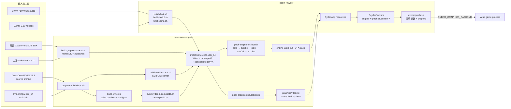

# 從零建置 Cyder Wine Engine

本文件以目前 Cyder011 目標為例，說明如何從空白 checkout 建立可供 Cyder
測試的完整 engine 與 graphics payload。它涵蓋兩個 sibling repository：

- `cyder-wine-engine`：CrossOver/Wine、MoltenVK、host dylib、CompatDB、簽署與
  engine archive。
- `ogom`：Cyder app、DXVK/DXVK2/DXMT payload、runtime 安裝與啟動 prepend。

Engine repo 不會把 CrossOver source archive 或第三方 binary source 放進 Git；
請只使用有權使用及重新散布的來源。

## 目前建置座標

| 項目 | Cyder011 目標 |
|---|---|
| CrossOver / Wine | CrossOver 26.3.0 / Wine 11.0 |
| Engine label | `CX26.3.0-W11-Cyder011` |
| Host | macOS x86_64，Apple Silicon 以 Rosetta 2 執行 |
| Host minOS | 10.15（所有 engine host Mach-O；DXMT 是明確例外） |
| MapleStory | CX26 MapleStory compatibility stack；D3DMetal / Apple GPTK 為主要路徑 |
| MoltenVK | 上游 1.4.0 + 3 個 Cyder source patch |
| DXVK | 1.10.3，獨立 `lib/dxvk` payload |
| DXVK2 | 上游 2.7.1，獨立 `lib/dxvk2` payload |
| DXMT | 上游 0.80，獨立 `lib/dxmt` payload |

MoltenVK 的 `--vulkan-source crossover` 參數名稱是 Wine 的 CrossOver Vulkan
整合路徑；在目前流程中，它讀取 `install/graphics-cx26-x86_64` 內由上游
MoltenVK 1.4.0 建出的 dylib，**不是**從 CrossOver.app 複製 MoltenVK。只有明確
設定 `MOLTENVK_SOURCE=crossover-foss` 才是 legacy source comparison。
新楓之谷的正式 D3DMetal 路徑不需要 MoltenVK；MoltenVK 只在另建 DXVK 驗證路徑時
啟用。

## 架構總覽



重點是：engine archive 保留 Wine、`cxcompatdb.so` 與（若是 DXVK release profile）新版 MoltenVK，但排除
`lib/dxvk`、`lib/dxvk2`、`lib/dxmt`；三種 graphics payload 由獨立 archive
安裝，啟動時才由 CompatDB 依環境變數 prepend。MapleStory 的 D3DMetal profile
不因為 MoltenVK 缺席而失效。

## 1. 準備主機

### Xcode

必須安裝完整 Xcode，Command Line Tools 不足以編譯 MoltenVK。確認：

```bash
xcode-select -p
xcodebuild -version
```

例如 macOS 15.3–26.1 可使用 Xcode 16.4；macOS Tahoe 26.2 以上可使用
Xcode 26.x。切換到完整 Xcode：

```bash
sudo xcode-select --switch /Applications/Xcode.app/Contents/Developer
sudo xcodebuild -license accept
sudo xcodebuild -runFirstLaunch
```

Apple Silicon 還需要 Rosetta 2：

```bash
softwareupdate --install-rosetta --agree-to-license
```

### Checkout 與環境

```bash
git clone <cyder-wine-engine-url> cyder-wine-engine
git clone <ogom-url> ogom
cd cyder-wine-engine
cp .env.example .env
```

`.env` 的預設值是 `MACOSX_DEPLOYMENT_TARGET=10.15`。除非有完整的相容性審查，
不要把它提高；否則 engine 可能無法在舊版 macOS 啟動。

### 必要輸入 archive

將檔案放到 `cyder-wine-engine/tools/archives/`：

```text
crossover-sources-26.3.0.tar.gz
llvm-mingw-20260616-ucrt-macos-universal.tar.xz
```

DXVK/DXVK2 的 source archive 或 Git checkout、DXMT release 由 `ogom` 的腳本
處理；詳見 `ogom/docs/build-dxvk.zh-TW.md`。

## 2. 準備 CrossOver source 與工具鏈

```bash
cd /path/to/cyder-wine-engine
bash scripts/prepare-build-deps.sh --cx 26
```

預期目錄：

```text
build/llvm-mingw-20260616-ucrt-macos-universal/
build/cx26/sources/wine/
```

如果需要重新解壓，使用 `--force`；不要直接刪除不明的 build 目錄，以免誤刪
其他版本的增量 source。

## 3. 建立 Homebrew x86_64 與基礎依賴

第一次建置建議先只做依賴安裝與無 Vulkan configure。這一步會建立專案自己的
`.brew-x86`，不使用 Apple Silicon 的 `/opt/homebrew`：

```bash
bash scripts/build-wine.sh \
  --cx 26 \
  --bootstrap-brew \
  --install-deps \
  --configure-only \
  --without-vulkan
```

若 `.brew-x86` 已存在，可省略 `--bootstrap-brew`。`env-x86_64.sh` 會自動設定
Rosetta PATH、Homebrew prefix、llvm-mingw 路徑及 minOS flags。

## 4. 建立 media stack（建議）

Wine 的 `winegstreamer` 需要可重新分發且符合 10.15 minOS 的 GLib/GStreamer：

```bash
bash scripts/build-media-stack.sh --cx 26 --install-deps
```

這一步會輸出到 `install/media-cx26-x86_64/`，最後由 bundler 複製需要的 dylib
到 engine tree。若不需要音訊／影片功能，可以跳過，但應在測試報告中註明。

若要支援 OEM25 已具備的遊戲內影片，另外建置完整影音 profile：

```bash
bash scripts/build-media-stack.sh --cx 26 --full-video
```

這會輸出到 `install/media-cx26-full-video-x86_64/`，不覆蓋最小 profile，並納入
Apple media、ASF、AVI、ISO MP4、playback、video filter、video parser 插件與
`gst-plugin-scanner`。`gst-libav` 維持關閉，因為它需要額外的 FFmpeg 依賴，且不在
OEM25 的實際插件集合中。

Cyder011 發佈時，打包器預設會把 full-video profile 內嵌進 engine artifact，並將
插件放在 `lib/wine/gstreamer-1.0/`、scanner 放在
`libexec/gstreamer-1.0/`；不再依賴安裝機器的 media path：

```bash
CYDER_ENGINE_VERSION_LABEL='CX26.3.0-W11-Cyder011' \
  bash scripts/pack-engine-artifact.sh --xz --force
```

只有刻意製作非影片的縮減版時才使用
`bash scripts/pack-engine-artifact.sh --media-profile minimal`。DXMT／DXVK 仍維持
獨立 graphics payload，不與 GStreamer 混在同一個 payload。

## 5. 建立新版 MoltenVK

### 5.1 取得、驗證與套 patch

```bash
bash scripts/ensure-moltenvk-source.sh
```

腳本固定 MoltenVK 1.4.0 SHA-256，並拒絕以不明內容覆蓋既有 source。建置腳本
依序套用：

1. `cyder-moltenvk-crossover-capability-hacks.patch`
2. `cyder-moltenvk-timeline-wait-poll.patch`
3. `cyder-moltenvk-present-autoreleasepool.patch`

### 5.2 編譯

```bash
bash scripts/build-graphics-stack.sh \
  --cx 26 \
  --install-deps \
  --moltenvk-source upstream
bash scripts/build-graphics-stack.sh \
  --cx 26 \
  --moltenvk-source upstream
```

產物為：

```text
install/graphics-cx26-x86_64/lib/libMoltenVK.dylib
install/graphics-cx26-x86_64/version
```

確認 `version` 顯示 `moltenvk 1.4.0`、`source upstream`，且 `otool -l` 的
`minos` 不高於 10.15：

```bash
cat install/graphics-cx26-x86_64/version
otool -l install/graphics-cx26-x86_64/lib/libMoltenVK.dylib | grep -A2 minos
```

Cyder011 不應再使用 `libMoltenVK.real.dylib` shim pair，也不應透過
`install-crossover-app-moltenvk.sh` 取得正式 MoltenVK。

## 6. 編譯並安裝 Wine engine

若目標是新楓之谷 D3DMetal candidate，先建隔離的 media stack，再使用下列單一
CX26 engine profile：

```bash
bash scripts/build-media-stack.sh --cx 26 --install-deps
bash scripts/build-media-stack.sh --cx 26
bash scripts/build-wine.sh --cx 26 --maplestory --without-vulkan
```

這條路徑仍會編譯 `cxcompatdb.so`，但不要求 MoltenVK。以下 `--with-vulkan` 命令
只用於同一 CX26 engine 的 DXVK / MoltenVK capability validation。

```bash
bash scripts/build-wine.sh \
  --cx 26 \
  --with-vulkan \
  --vulkan-source crossover \
  --jobs "$(sysctl -n hw.ncpu)"
```

此步驟會：

1. 套用 `patches/README.md` 所列的 CX26 patch set。
2. 以 `--enable-win64` 及 i386/x86_64 PE 建立 Wine。
3. 將 Wine 安裝到 `install/wine-cx26-x86_64/`。
4. 編譯 `runtime/cxcompatdb/cxcompatdb.c` 成 `cxcompatdb.so`。
5. 若使用 `--with-vulkan`，以新版 `GRAPHICS_INSTALL` 綁定 MoltenVK，並重寫 dylib
   install name；`--without-vulkan` 的 MapleStory D3DMetal build 不執行這個依賴。

確認：

```bash
arch -x86_64 install/wine-cx26-x86_64/bin/wine --version
test -f install/wine-cx26-x86_64/lib/wine/x86_64-unix/cxcompatdb.so
test -f install/wine-cx26-x86_64/lib/wine/x86_64-unix/libMoltenVK.dylib
test ! -e install/wine-cx26-x86_64/lib/wine/x86_64-unix/libMoltenVK.real.dylib
```

若增量 build 曾使用錯誤 SDK／minOS，先執行：

```bash
bash scripts/rebuild-wine-host-unix.sh
```

不要把半成品直接複製到 `~/.cyder/runtime`。

## 7. 建立 DXVK、DXVK2 與 DXMT payload

這些工作在 `ogom` 執行，且安裝到同一個 engine install tree：

```bash
cd /path/to/ogom
ENGINE=/path/to/cyder-wine-engine/install/wine-cx26-x86_64

bash scripts/build-dxvk.sh  --engine "$ENGINE"
bash scripts/build-dxvk2.sh --engine "$ENGINE"
bash scripts/fetch-dxmt.sh  --engine "$ENGINE"
```

預期目錄：

```text
$ENGINE/lib/dxvk/     # DXVK 1.10.3，Windows PE
$ENGINE/lib/dxvk2/    # DXVK 2.7.1，Windows PE
$ENGINE/lib/dxmt/     # DXMT 0.80，含 winemetal.dll/.so
```

DXVK/DXVK2 的 PE 必須含 `Wine builtin DLL` stamp；上述 build script 及最後的
engine pack 都會檢查／補 stamp。DXMT 的 `winemetal.dll` 應在 ensure 時同步放入
prefix，這是 runtime payload 的一部分，不是 MoltenVK。

## 8. 測試與打包

回到 engine repo，先跑窄測試，再跑完整測試：

```bash
cd /path/to/cyder-wine-engine
bash tests/test-moltenvk-1-4-source-and-capabilities.sh
bash tests/test-maplestory-patch-stack.sh
bash tests/test-maplestory-d3dmetal-launcher.sh
bash tests/test-pack-graphics-payloads.sh
bash tests/test-engine-manifest.sh
bash tests/run.sh
```

完整測試若因本機 wineserver／CoreSimulator service 失敗，需把失敗測試名稱、
系統版本與 log 一併記錄；不能把「測試框架失敗」當成 graphics pass。

使用測試版簽署：

```bash
CYDER_ENGINE_VERSION_LABEL='CX26.3.0-W11-Cyder011' \
SIGN_IDENTITY='-' \
  bash scripts/pack-engine-artifact.sh --xz --force
```

打包器預設使用 `full-video` media profile；若只是測試最小影音 fallback，需明確
指定 `--media-profile minimal`。

正式發布時將 `SIGN_IDENTITY` 改為 Developer ID Application identity。打包器會
依序執行：

```text
copy（排除 lib/dxvk、lib/dxvk2、lib/dxmt）
→ strip
→ bundle relocatable dylibs
→ codesign
→ host minOS scan
→ tar.xz
→ 解壓後再次驗證簽章
```

輸出：

```text
dist/artifacts/engine-wine-x86_64-CX26-3-0-W11-Cyder011.tar.xz
dist/artifacts/engine-wine-x86_64-CX26-3-0-W11-Cyder011.tar.xz.sha256
dist/artifacts/engine-wine-x86_64-CX26-3-0-W11-Cyder011.tar.xz.manifest.json
dist/artifacts/graphics/dxvk-1.10.3.tar.zst
dist/artifacts/graphics/dxvk2-2.7.1.tar.zst
dist/artifacts/graphics/dxmt-0.80.tar.zst
```

確認 engine archive 只含單一 MoltenVK：

```bash
tar -tJf dist/artifacts/engine-wine-x86_64-CX26-3-0-W11-Cyder011.tar.xz \
  | grep -E 'libMoltenVK|lib/dxvk|lib/dxmt'
```

預期只有 `lib/wine/x86_64-unix/libMoltenVK.dylib`；graphics payload 會出現在
`dist/artifacts/graphics/` 的獨立 archive。

## 9. 匯入 Cyder 並做 smoke test

將 engine archive、sidecar manifest 與三個 graphics archive 交給 `ogom` 的
import／release 流程；不要手動解壓覆蓋使用者 runtime。Cyder 應驗證：

- archive SHA-256 與 sidecar 一致；
- embedded／sidecar manifest、`version` 與 NTDLL SHA-256 一致；
- engine 中沒有 `lib/dxvk*`／`lib/dxmt`；
- graphics payload 的 version／SHA sidecar 齊全；
- runtime 建立 `current-dxvk`、`current-dxvk2`、`current-dxmt` 後，再建立 engine
  `lib/dxvk*`／`lib/dxmt` 的接線；
- 啟動 log 明確記錄 graphics backend 與 payload 路徑；只有 DXVK 路徑額外記錄 MoltenVK。

最後至少以 D3DMetal、`wined3d`、DXVK 1.x、DXVK2 各啟動一次；若測 DXMT，確認 macOS
版本符合 DXMT 要求，並確認 prefix 內有 `winemetal.dll`。

## 常見問題

| 症狀 | 原因 | 處理 |
|---|---|---|
| `xcodebuild requires Xcode` | 只有 Command Line Tools，或 `xcode-select` 指錯 | 安裝完整 Xcode，切到 `/Applications/Xcode.app/Contents/Developer` |
| `Refusing to replace non-MoltenVK path` | pinned source path 不是 1.4.0 或內容不完整 | 檢查 `build/moltenvk-1.4.0`；非標準路徑請使用 `MOLTENVK_SOURCE=custom` |
| `Missing graphics payload` | engine install 沒有 `lib/dxvk*`／`lib/dxmt` | 先執行 ogom 的 build/fetch script，再 pack |
| `minos exceeds product floor` | 使用了新 macOS bottle 或錯誤 SDK flags | 用專案 `.brew-x86`，確認 `MACOSX_DEPLOYMENT_TARGET=10.15`，重建 host dylib |
| `DXVK` log 但實際是 WineD3D | DLL 沒有 builtin stamp、payload 未安裝或舊 engine 不認識 token | 檢查 offset 64、runtime payload、`cxcompatdb.so` 與 engine label |
| DXMT 啟動後立即結束 | 缺 `winemetal.dll` 或 macOS 不符合 DXMT 要求 | 重新 ensure DXMT，確認 prefix 與 payload 的 Windows／unix 檔案完整 |
| 打包後出現 `libMoltenVK.real.dylib` | 混入舊 CrossOver shim | 清理 install tree 後重新 bundle；Cyder011 只使用 source-built 單一 dylib |

## 相關文件

- [patches/README.md](../patches/README.md)：patch 順序與理由。
- [incremental-build-and-patches.md](incremental-build-and-patches.md)：增量編譯、minOS 與污染的 build tree。
- [integration-with-cyder.md](integration-with-cyder.md)：engine archive 與 Cyder 的 manifest 契約。
- `ogom/docs/build-dxvk.zh-TW.md`：DXVK 1.x／2.x 編譯細節。
- `ogom/docs/cyder-graphics-runtime-pipeline.zh-TW.md`：runtime payload 與啟動 prepend。
