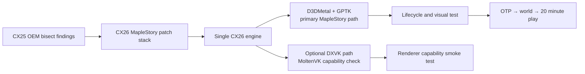

# 新楓之谷 CX26 單一引擎移植與測試計畫

## 目標

以 CX26.3 / Wine 11 為唯一持續維護的引擎，將研究分支
`codex/maplestory-oem-special` 已確認的 CX25 OEM 相容性差異移植進來。CX25 OEM
只保留為已知可玩的參考與 fallback；不再維護第二套 CX25 source build。

圖形 backend 的責任要分開：

- 新楓之谷正式路徑使用 D3DMetal / Apple GPTK，不要求 MoltenVK。
- DXVK 是另一條可選的驗證路徑；只有選 DXVK 時才檢查 MoltenVK capability。
- 兩條路徑共用同一個 CX26 Wine engine 與 MapleStory compatibility patch stack。



## 已移植的功能群

`scripts/build-wine.sh --cx 26 --maplestory` 會依序套用：

1. MapleStory core：raw audio parser、WineD3D user-memory / format-conversion staging。
2. kernelbase source module name 與 dbghelp DWARF guard。
3. D3D11 shared texture、完整 ClearView / UAV clear、DXGI shared handle、texture reload。
4. winemac foreground BlackXchg、fullscreen restore 與 CX25 對齊的 no-sched-yield。

shared texture 與 full-clear 必須視為同一功能群，不能拆成只保留「有一點畫面」的
半成品配置。所有 patch 都放在 engine repo，release manifest 也會記錄順序。

## 建置策略

```sh
bash scripts/build-media-stack.sh --cx 26 --install-deps
bash scripts/build-media-stack.sh --cx 26
bash scripts/build-wine.sh --cx 26 --maplestory --without-vulkan
```

`RAW_AUDIO_PARSE=1` 仍需要隔離的 x86_64 GLib/GStreamer runtime；這是媒體處理
依賴，不是 Vulkan 依賴。若要驗證 DXVK，另建 `--with-vulkan` 並提供已測試的
MoltenVK，不得把該依賴帶進 D3DMetal 的 gate。

## 測試分層

| 層級 | 入口 | 通過條件 |
|---|---|---|
| 靜態契約 | `tests/test-maplestory-patch-stack.sh` | patch 檔、manifest、CX26-only 與 D3DMetal-neutral 條件成立 |
| 乾淨 source | 同上 | 所有 patch 可對 CX26.3.0 source 正向套用 |
| D3DMetal launcher | `tests/test-maplestory-d3dmetal-launcher.sh` | 強制 `CYDER_GRAPHICS_BACKEND=d3dmetal`，不引用 MoltenVK |
| engine regression | `tests/run.sh` | 既有引擎測試通過；若本機 wineserver 不可用，須標記為環境阻塞 |
| lifecycle smoke | `scripts/run-maplestory-cx26-d3dmetal.sh --no-otp` | MapleStory、BlackCipher/NGS、視窗與 renderer lifecycle 可追蹤 |
| 真實驗收 | 同一 launcher + 有效 BeanFun argv | 登入、進世界、地圖/UI/滑鼠正常，持續遊玩至少 20 分鐘 |

自動 log 只能證明 module load、process lifetime 與 renderer 初始化，不能單獨證明
「不是黑畫面」。最後一層必須人工確認登入畫面與進世界畫面；測試期間保留同一個
prefix、遊戲目錄與 debug log，避免把 bottle 差異誤判為 engine 修復。

## 實機測試入口

```sh
bash scripts/run-maplestory-cx26-d3dmetal.sh \
  --launch-exe '/absolute/path/to/MapleStory.exe' \
  --compatdb '/path/to/CompatDB/compatdb.cdb' \
  --no-otp
```

launcher 會自動尋找本機 CX26 engine 與既有 GPTK；CompatDB policy 是 Cyder app
提供的 `.cdb`，不可把 `cxcompatdb.so` 誤當成 policy database。若 GPTK 不在標準
位置，可補上 `--gptk-root PATH`。真實登入測試再把 BeanFun host、port、ServiceAccountID 與 OTP
放在 `--` 後面；OTP 不會寫入 launcher summary log。

驗收順序固定為：

1. 乾淨 prefix / `MapleTest` cwd 的無 OTP lifecycle。
2. 有效 OTP 登入與角色選擇。
3. 進入地圖後確認地圖、UI、滑鼠與音訊。
4. 連續遊玩 20 分鐘，記錄 BlackCipher/NGS 是否持續存活與 CPU/GPU/能耗觀察。
5. 若失敗，先依 log 判斷是認證、anti-cheat lifecycle、renderer 初始化或畫面交接，
   再決定是否需要下一組 patch；不要先切換到 MoltenVK。
