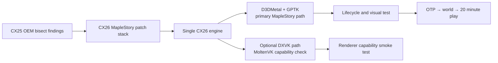

# 新楓之谷 CX26 單一引擎移植與測試計畫

## 目標

以 CX26.3 / Wine 11 為唯一持續維護的引擎，將研究分支
`codex/maplestory-oem-special` 已確認的 CX25 OEM 相容性差異移植進來。CX25 OEM
只保留為已知可玩的參考與 fallback；不再維護第二套 CX25 source build。

圖形 backend 的責任要分開：

- 新楓之谷正式路徑使用 D3DMetal / Apple GPTK，不要求 MoltenVK。
- DXVK 是另一條可選的驗證路徑；只有選 DXVK 時才檢查 MoltenVK capability。
- 兩條路徑共用同一個 CX26 Wine engine 與 MapleStory compatibility patch stack。



## 已移植的功能群

`scripts/build-wine.sh --cx 26 --maplestory` 會依序套用：

| 功能群 | 包含內容 | 重用性／來源 | 重要性 | 對其他應用程式的影響 | 採用建議 |
|---|---|---|---|---|---|
| 媒體與 WineD3D core | `maplestory-cx26-core.patch`：raw audio parser、user-memory texture pin、format-conversion staging | 可重用於需要 raw audio 或 CPU／GPU texture staging 的 Win32 遊戲；核心做法來自 CX25 OEM／CrossOver 相容性差異，但不是 MapleStory 專屬 API | 高 | 中；會影響 `winegstreamer` 與 `wined3d` 中使用相同 texture／audio 路徑的程式，可能改變記憶體與效能 | 採用；先在 CX26 MapleStory stack 啟用，之後可依 regression 結果推廣 |
| 暫存模組載入與 DWARF | `maplestory-cx26-tmp-module-name.patch`、`maplestory-cx26-dbghelp-dwarf-guard.patch` | `.tmp`／`.msf` 載入可重用於會複製或重新命名 PE payload 的 anti-cheat／更新器；DWARF guard 可泛化為 debugger robustness | 高 | 低至中；loader／dbghelp 是共用路徑，但修補已限制在無效或不完整 symbol metadata，不改正常模組解析 | 採用；`.tmp` 命名仍以有效 payload／module-name 條件限制，DWARF guard 可廣泛重用 |
| D3D11 shared resource 與 texture clear | `maplestory-cx26-d3d11-shared-texture-test.patch`、`maplestory-cx26-d3d11-full-clear.patch`、`maplestory-cx26-dxgi-shared-handle.patch`、`maplestory-cx26-texture-user-memory-reload.patch` | 可重用於使用 shared texture、`ClearView`／UAV clear、producer／consumer handle 或 user-memory texture 的 D3D11 應用程式；CX25 bisect 顯示它們是同一個資源生命週期契約 | 關鍵；拆開會得到局部畫面或再次黑畫面 | 中至高；會影響 D3D11 resource ownership、clear 語義與同步，可能改變其他遊戲的畫面正確性或效能 | 採用；四個 patch 視為不可拆功能群，並以 D3D11 shared-resource regression 維持品質 |
| D3DMetal view／surface 交接 | `maplestory-cx26-d3dmetal-legacy-surface.patch`、`maplestory-cx26-plain-metal-layer.patch` | 可重用於 D3DMetal 應用程式需要沿用可見 client view、Metal layer 或 helper process surface 的情況；概念是 CX25 OEM 的 view ownership | 高；決定 D3DMetal 是否能持續 present | 中；修改 `winemac.drv` 的 view／layer 交接，可能影響多視窗、overlay、retina 或 helper window | 採用；保留 view／helper 條件判斷，並以多視窗、overlay 與 retina regression 驗證 |
| 視窗、焦點與反作弊 helper | `maplestory-cx26-window-resizable-flag.patch`、`maplestory-cx26-blackxchg-foreground.patch`、`maplestory-cx26-fullscreen-restore.patch` | 可重用於有 anti-cheat／overlay helper、fullscreen restore 或 resize handoff 的遊戲；`BlackXchg` 判斷本身維持 MapleStory 專屬 | 高；避免 helper 啟動或 resize 後失去前景／畫面交接 | 中；會改變 macOS foreground、resize 與 fullscreen 行為，可能影響其他遊戲的 focus、Alt+Enter 或 overlay | 採用；BlackXchg 維持 app-specific，其他 window／fullscreen 修正保留精確條件 |
| `win32u` message-wait handoff | `maplestory-cx26-message-wait-handoff.patch`：保留 upstream queue retry；queue 已就緒時不把無效 handle 清單送入等待 | 控制流可廣泛重用，保留 upstream retry 語義；在 queue 已就緒時避免驗證尚未可用的 app handle list，不改真正 invalid-handle 的錯誤語義 | 關鍵；已由實機確認可越過 CX26 黑畫面 gate 到登入畫面 | 低；對其他遊戲只改變 queue 已經 ready 時的 handoff 時序，不吞掉 `STATUS_INVALID_HANDLE`，不改正常 handle wait | 廣泛採用於 CX26；不再限制在 MapleStory profile，並保留 message／wait regression |
| CX25 OEM scheduler 對齊 | `maplestory-cx26-no-sched-yield.patch`：只在 `MapleStory.exe` process image 停止 host scheduler yield | 重用範圍限於 MapleStory.exe 的啟動／反作弊時序；其他 process image 維持 Wine 原本的 `sched_yield()` 行為 | 高；是 MapleStory 啟動／反作弊時序的一部分，但不是 renderer 本身 | 無；guard 以 process image basename 精確限制，其他遊戲不受此修改影響 | 採用，但只在 `MapleStory.exe` 啟用；不得改成全域停用 scheduler yield |
| 非 Vulkan 的建置 fallback | `w1-win32u-vulkan-soname.patch` 與 `--vulkan-soname-fallback` | 只適用於特定 CX26 source／configure 狀態的 build workaround；與 MapleStory runtime graphics 無關 | 低；只解除特殊編譯／連結阻塞 | 預設 build 無影響；顯式啟用時只影響 build，不影響 D3DMetal runtime，也不載入 MoltenVK | 不採用於預設或 release manifest；僅特殊 source tree／建置故障時明確指定使用 |

shared texture 與 full-clear 必須視為同一功能群，不能拆成只保留「有一點畫面」的
半成品配置。所有 patch 都放在 engine repo，release manifest 也會記錄順序。

### 採用範圍結論

目前建議的邊界是：由單一 CX26 engine 共用可泛化的修正，將 MapleStory 專屬行為保留
在 `--maplestory` compatibility profile；不要為了 D3DMetal 路徑引入 MoltenVK。採用
範圍如下：

1. `win32u` queue handoff 與其他已驗證的架構性修正採用於 CX26 共用路徑；
   `win32u` 修正保留正常 invalid-handle 錯誤語義。
2. 其他 MapleStory renderer、loader、window 與 anti-cheat 功能群採用於正式
   `--maplestory` profile；其中 BlackXchg 與 `MapleStory.exe` scheduler guard
   保留精確 app 條件。
3. `w1-win32u-vulkan-soname.patch` 不進預設 patch stack 或 release manifest，只有
   特殊 build 故障時明確使用 `--vulkan-soname-fallback`。

這份影響評估是依目前 patch 觸及的 Wine subsystem 與 A/B 結果推導；目前已驗證的是
CX26 + D3DMetal 到登入畫面，尚未完成其他遊戲的全面 regression 或實際 OTP 登入後
20 分鐘遊玩，因此「可泛化」項目仍須在擴大採用前補測。

## 建置策略

```sh
bash scripts/build-media-stack.sh --cx 26 --install-deps
bash scripts/build-media-stack.sh --cx 26
bash scripts/build-wine.sh --cx 26 --maplestory --without-vulkan
```

若要驗證遊戲內影片，使用獨立的 OEM25-equivalent profile，不覆蓋現有最小影音
runtime：

```sh
bash scripts/build-media-stack.sh --cx 26 --full-video
```

此 profile 會建立 base/good/ugly/bad 中與 OEM25 對應的插件：Apple media、ASF、
AVI、ISO MP4、audio parser、playback、video filter、video parser、WAV parser 與
GStreamer plugin scanner。
它不打開 `gst-libav`，所以不會因為 FFmpeg 或額外 GPL codec 將 D3DMetal engine
路徑擴大；這裡的「完整」是指 OEM25 可用的影音插件集合，而不是任意抓取所有
主機可選 codec。

`RAW_AUDIO_PARSE=1` 仍需要隔離的 x86_64 GLib/GStreamer runtime；這是媒體處理
依賴，不是 Vulkan 依賴。若要驗證 DXVK，另建 `--with-vulkan` 並提供已測試的
MoltenVK，不得把該依賴帶進 D3DMetal 的 gate。

## 測試分層

| 層級 | 入口 | 通過條件 |
|---|---|---|
| 靜態契約 | `tests/test-maplestory-patch-stack.sh` | patch 檔、manifest、CX26-only 與 D3DMetal-neutral 條件成立 |
| 乾淨 source | 同上 | 所有 patch 可對 CX26.3.0 source 正向套用 |
| D3DMetal launcher | `tests/test-maplestory-d3dmetal-launcher.sh` | 強制 `CYDER_GRAPHICS_BACKEND=d3dmetal`，不引用 MoltenVK |
| engine regression | `tests/run.sh` | 既有引擎測試通過；若本機 wineserver 不可用，須標記為環境阻塞 |
| lifecycle smoke | `scripts/run-maplestory-cx26-d3dmetal.sh --no-otp` | MapleStory、BlackCipher/NGS、視窗與 renderer lifecycle 可追蹤 |
| 真實驗收 | 同一 launcher + 有效 BeanFun argv | 登入、進世界、地圖/UI/滑鼠正常，持續遊玩至少 20 分鐘 |

自動 log 只能證明 module load、process lifetime 與 renderer 初始化，不能單獨證明
「不是黑畫面」。最後一層必須人工確認登入畫面與進世界畫面；測試期間保留同一個
prefix、遊戲目錄與 debug log，避免把 bottle 差異誤判為 engine 修復。

## 實機測試入口

```sh
bash scripts/run-maplestory-cx26-d3dmetal.sh \
  --launch-exe '/absolute/path/to/MapleStory.exe' \
  --compatdb '/path/to/CompatDB/compatdb.cdb' \
  --no-otp
```

launcher 會自動尋找本機 CX26 engine 與既有 GPTK；CompatDB policy 是 Cyder app
提供的 `.cdb`，不可把 `cxcompatdb.so` 誤當成 policy database。若 GPTK 不在標準
位置，可補上 `--gptk-root PATH`。真實登入測試再把 BeanFun host、port、ServiceAccountID 與 OTP
放在 `--` 後面；OTP 不會寫入 launcher summary log。

驗收順序固定為：

1. 乾淨 prefix / `MapleTest` cwd 的無 OTP lifecycle。
2. 有效 OTP 登入與角色選擇。
3. 進入地圖後確認地圖、UI、滑鼠與音訊。
4. 連續遊玩 20 分鐘，記錄 BlackCipher/NGS 是否持續存活與 CPU/GPU/能耗觀察。
5. 若失敗，先依 log 判斷是認證、anti-cheat lifecycle、renderer 初始化或畫面交接，
   再決定是否需要下一組 patch；不要先切換到 MoltenVK。
